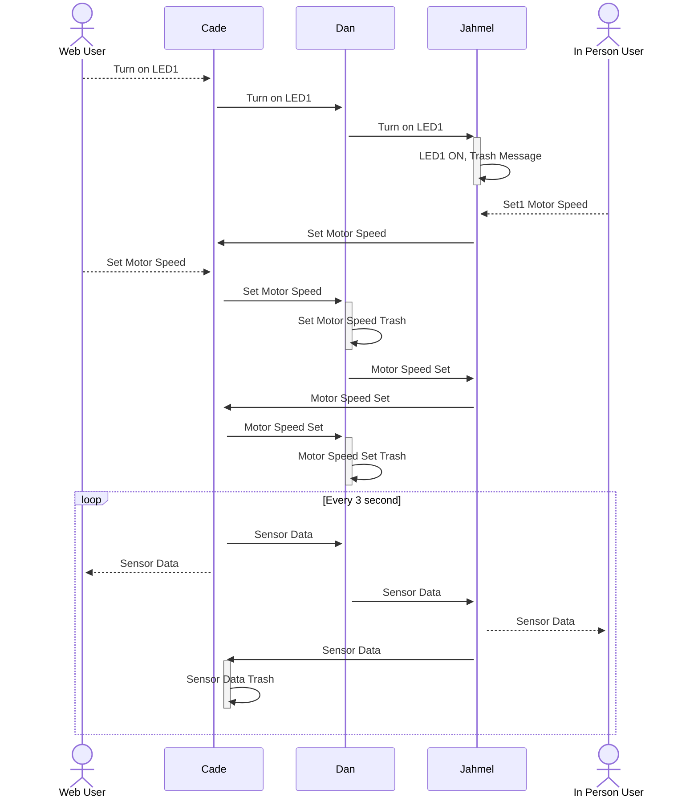

---
tags:
- tag1
---

## **Block Diagram**

The team’s block diagram outlines the flow of communication and functionality across different components in the system. Cade, utilizing an ESP32 microchip, serves as the central hub for bidirectional communication with the other team members, who use PIC microcontrollers. Data flows sequentially from Cade to Dan, who manages both sensor integration and actuator control, and then to Jahmel, responsible for the Human-Machine Interface (HMI), before looping back to Cade. The boards communicate via UART, ensuring reliable data transmission between each module. Additionally, the sensor and actuator exchange data through either SPI or I2C protocols, enabling efficient and precise control of the system’s operation.

### Block Diagram Structure and Design Decisions

The block diagram was structured to clearly represent the final architecture of the system, reflecting the final team composition and clearly defined subsystem responsibilities: Fan Board (actuation), Wi-Fi Board (server communication), and HMI Board (user interface). Each module is connected via UART, while the Wi-Fi Board manages bidirectional communication with a server over Wi-Fi.

The decision to use a modular structure was based on product requirements emphasizing real-time responsiveness, clear subsystem roles, and ease of debugging. Isolating functionality by board simplifies troubleshooting and allows parallel development among team members. All power and signal lines were documented to ensure traceability and consistency with the schematic.

## **Sequence Diagram**

The sequence diagram illustrates the communication flow between users and system components, ensuring synchronized operation. When a Web User requests to turn on LED1, the command is passed sequentially from Cade to Dan, and then to Jahmel, who activates the LED and discards the processed message. Similarly, when an In-Person User sets the motor speed, the request travels from Jahmel to Cade, and then to Dan, who executes the command before discarding the message. Additionally, sensor data is transmitted in a continuous 1-second loop, where Dan sends data to Jahmel. Jahmel provides real-time feedback to the In-Person User while also relaying the data to Cade, who then updates the Web User before discarding the received data. This structured communication ensures efficient data flow and command execution throughout the system.

## Functionality of Communication Sequence Diagram

How the Diagram Meets Product Requirements
The communication sequence diagram illustrates the data flow between users, system components, and subsystems, effectively meeting key product requirements for real-time data exchange, responsive control, and system feedback.

**User Interaction:** The diagram begins with both Web User and In Person User actions, such as turning on an LED or setting the motor speed. This satisfies the product requirement for user control and remote monitoring via web and local interfaces.

**Message Propagation:** Messages are passed through various system components (Cade, Dan, Jahmel), reflecting the distributed nature of the system. Each actor communicates with the next in line to trigger changes like turning on LEDs or setting motor speeds, fulfilling the need for inter-component communication.

**Data Synchronization:** The diagram shows periodic sensor data updates every 3 seconds, aligning with the product requirement for continuous feedback from the system, ensuring that temperature and motor speed information is regularly sent to users and across the system.

**Trash Message Handling:** The inclusion of "trash" messages indicates that some messages are discarded, reflecting a decision to filter out invalid or redundant data. This ensures message integrity and reduces unnecessary processing, maintaining system efficiency.

## Design Decision Process

The decision to structure the diagram with multiple actors and clear message flows was driven by the need to represent both user interaction and automated processes within the system. The team prioritized clarity in showing how user inputs translate into actions across different components, ensuring that the process is transparent and easy to follow.

**Multiple User Types:** The inclusion of both a Web User and In Person User reflects different control interfaces, meeting the user needs for flexibility in managing the system remotely or locally.

**Modular Flow of Communication:** The diagram breaks down the interaction into manageable steps, where each system actor (Cade, Dan, Jahmel) has a clear responsibility, emphasizing modular design and separation of concerns, which is key to simplifying debugging and testing.

**Sensor Data Loop:** The loop at the end of the diagram ensures that sensor data is continually updated, fulfilling the requirement for real-time monitoring and enabling dynamic adjustments in fan speed and other system states.

**Trash Message Concept:** The team consciously added the concept of "trash" messages, ensuring that the system discards unnecessary or erroneous messages. This design choice helps maintain the system’s efficiency and responsiveness.

## Message ID

The Message ID table defines the unique identifiers for system members and their associated addresses. Each member is assigned a specific ID and address for communication within the system.

| Member        | System            | ID  | Address |
|---------------|-------------------|-----|---------|
| Cade Clonts   | Wifi              | 1   | 0x01    |
| Jahmel        | Human Interface   | 2   | 0x02    |
| Dan           | Fan Control       | 3   | 0x03    |
| Broadcast     | All               | 88  | 0x58    |

### Status

The Status table defines the status codes used in the system to indicate the state of a message or operation.

| Status | Code  |
|--------|-------|
| Normal | 0x00  |
| Error  | 0x01  |

## Message Types

The Message Types table categorizes the types of messages and their associated status or code ranges.

| Category         | Status/Code | Address |
|------------------|-------------|----|
| Temp Data        | 0 to 255  | 0x10 |
| Fan Control      | 0 to 3    | 0x20 |

---

### Temperature Sensor (Message Type 1)

The Temperature Sensor table defines the structure of messages for temperature data. Each byte in the message is mapped to a specific variable, with details about its type, range, and example values.

| Byte | Variable Name | Variable Type | Min Value | Max Value | Example Value |
|---|------------------|--------------|-----------|-----------|--------------|
| 1 | prefix_1        | uint8_t      | 0x41      | 0x41      | 0x41         |
| 2 | prefix_2        | uint8_t      | 0x5a      | 0x5a      | 0x5a         |
| 3 | source_id       | uint8_t      | 1         | 3         | 0x03         |
| 4 | destination_id  | uint8_t      | 1         | 3 & 88    | 0x58         |
| 5 | message_type    | uint8_t      | 0x10      | 0x10      | 0x10         |
| 6 | temp_id         | uint8_t      | 0         | 255       | 0x01         |
| 7 | status          | uint8_t      | 0         | 1         | 0x01         |
| 8 | temp_data_integer | uint8_t    | 0         | 255       | 25           |
| 9 | temp_data_fraction | uint8_t   | 0         | 99        | 50           |
| 10-62 | Unused       | uint8_t     | 0x00       | 0x00     | 0x00         |
| 63 | suffix_1        | uint8_t      | 0x59      | 0x59      | 0x59         |
| 64 | suffix_2        | uint8_t      | 0x42      | 0x42      | 0x42         |

### Fan Control (Message Type 2)

The Fan Control table defines the structure of messages for controlling fan speed. Each byte in the message is mapped to a specific variable, with details about its type, range, and example values.

| Byte  | Variable Name   | Variable Type | Min Value | Max Value | Example Value |
|-------|-----------------|--------------|-----------|-----------|--------------|
| 1     | prefix_1        | uint8_t      | 0x41      | 0x41      | 0x41         |
| 2     | prefix_2        | uint8_t      | 0x5a      | 0x5a      | 0x5a         |
| 3     | source_id       | uint8_t      | 1         | 3         | 0x01         |
| 4     | destination_id  | uint8_t      | 1         | 3 & 88    | 0x03         |
| 5     | message_type    | uint8_t      | 0x20      | 0x20      | 0x20         |
| 6     | fan_id          | uint8_t      | 0         | 1         | 0x01         |
| 7     | status          | uint8_t      | 0         | 1         | 0x01         |
| 8     | fan_speed_data  | uint8_t      | 0         | 3         | 0x02         |
| 9     | fan_speed_set   | uint8_t      | 0         | 3         | 0x01         |
| 10-62 | Unused          | uint8_t      | 0x00      | 0x00      | 0x00         |
| 63    | suffix_1        | uint8_t      | 0x59      | 0x59      | 0x59         |
| 64    | suffix_2        | uint8_t      | 0x42      | 0x42      | 0x42         |

### Message Type Matrix

- S = Sending Message
- R = Recieving Message

| Message Type               | Message ID | Cade Role: MQTT ID: 0x01                     | Dan Role: Motor ID: 0x03                      | Jahmel Role: HMI ID: 0x02                             |
|----------------------------|------------|---------------------------------------------------|----------------------------------------------------|-------------------------------------------------------------|
| sensor value               | 0x10       | S (Temperature Value in °C)                   | R (motor turns on to cool system)               | R (Debug LEDs on/off within value ranges)                |
| Set Motor Speed            | 0x20       | S (Publish 1, 2, or 3)                        | R (Set 1 = Low, 2 = Medium, 3 = High)           | S (toggle debug button press 1, 2, 3)                    |
| Motor Speed Status/Speed  | 0x20       | R (Upload 1, 2, 3)                            | S (Broadcast status/speed)                      | R (Debug LED blinks to recognize message)                |

# **Top 5 Biggest Changes to Software Design**

1. Rewriting UART Handling with Interrupts
Initially, UART communication used polling, which blocked execution and caused missed messages. The design was changed to use interrupt-driven UART to allow asynchronous communication, improving reliability and responsiveness across all boards.

2. Structured Message Parsing and Validation
Early versions lacked clear message framing or validation, resulting in inconsistent parsing. A robust parsing routine was added using delimiters and checksums to ensure complete and correct message handling, reducing system errors.

3. Fan Control Logic Centralized on Fan Board
Originally, fan speed decisions were handled by the Temperature Board. This created unnecessary complexity. The logic was moved to the Fan Board to encapsulate control and simplify message flow, aligning better with modular design principles.

4. Integration of a Message Buffer Queue
Initially, each board processed incoming messages immediately upon receipt, which caused issues when multiple messages arrived in quick succession or during critical processing windows. To resolve this, a message buffer queue was implemented for each board, allowing messages to be queued and processed sequentially. This change significantly improved system stability under high message traffic, ensured no messages were lost, and enabled smoother multitasking across modules.

5. Adjustment of Temperature Data Format for UART Compatibility
Initially, temperature values ranged from -40°C to 155°C. However, using an uint8_t data type for UART transmission caused issues, as it couldn't represent negative values. To resolve this, the team remapped the range to 0–255 by offsetting the raw temperature values (e.g., adding 40), allowing the full range to fit within a single byte. The decoding logic was then adjusted on the receiving end to subtract the offset and restore the correct temperature value. This ensured compatibility with the communication protocol without sacrificing accuracy.
