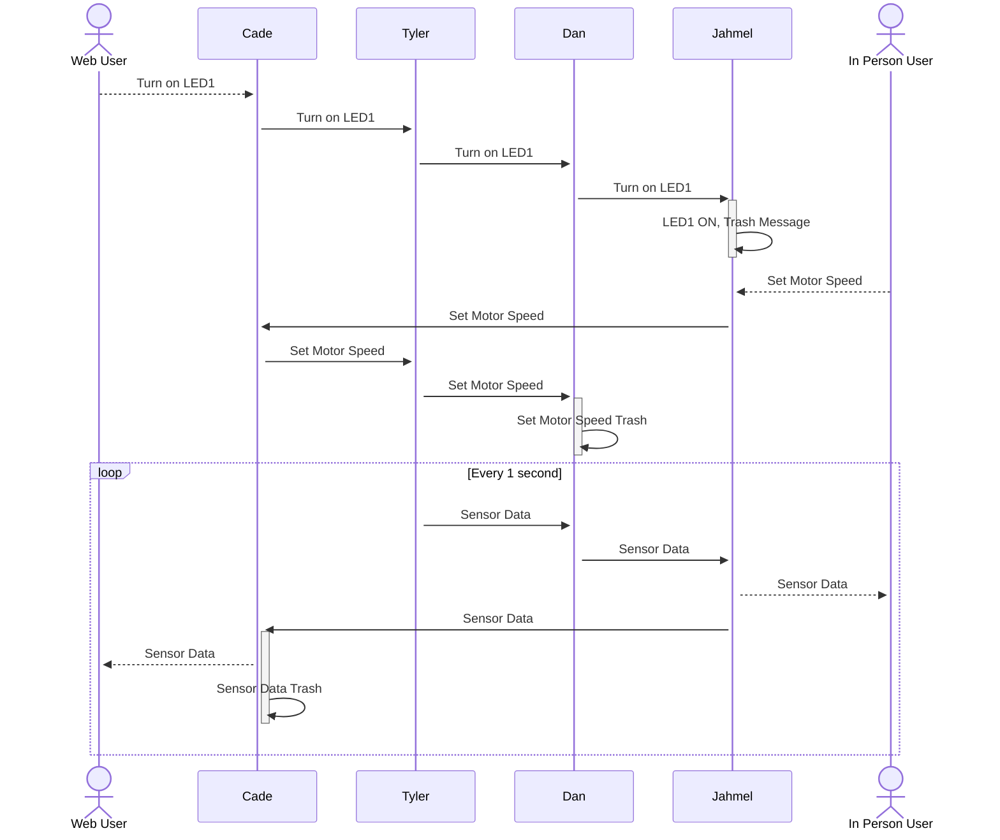

---
tags:
- tag1
---

## **Block Diagram**
The team’s block diagram outlines the flow of communication and functionality across different components in the system. Cade, utilizing an ESP32 microchip, serves as the central hub for bidirectional communication with the other team members, who use PIC microcontrollers. Data flows sequentially from Cade to Tyler, who manages sensor integration, then to Dan, who controls the actuator, and finally to Jahmel, responsible for the Human-Machine Interface (HMI), before looping back to Cade. The boards communicate via UART, ensuring reliable data transmission between each module. Additionally, the sensor and actuator exchange data through either SPI or I2C protocols, enabling efficient and precise control of the system’s operation.

## **Sequence Diagram**

The sequence diagram illustrates the communication flow between users and system components, ensuring synchronized operation. When a Web User requests to turn on LED1, the command is passed sequentially from Cade to Tyler, then to Dan, and finally to Jahmel, who activates the LED and discards the processed message. Similarly, when an In-Person User sets the motor speed, the request travels from Jahmel to Cade, through Tyler, and then to Dan, who executes the command before discarding the message. Additionally, sensor data is transmitted in a continuous 1-second loop, where Tyler sends data to Dan, who forwards it to Jahmel. Jahmel provides real-time feedback to the In-Person User while also relaying the data to Cade, who then updates the Web User before discarding the received data. This structured communication ensures efficient data flow and command execution throughout the system.

## Message System
Message Type 1: Sensor Reading (Temperature/Humidity)
Purpose:
Transmit the current temperature and humidity from the sensor.

Proposed Structure:

Bytes 1–2 (uint16_t): Message Type ID
Value: 0x0001
Byte 3 (uint8_t): Sensor ID
(For example, if you plan on having more than one sensor. Otherwise, this could be a fixed value like 0.)
Bytes 4–5 (int16_t): Temperature reading
(In tenths of degrees Celsius. For instance, 254 represents 25.4°C.)
Bytes 6–7 (uint16_t): Humidity reading
(Expressed in hundredths of a percent. For example, 5000 represents 50.00%)
Total Length: 7 bytes

Message Type 2: Fan Control Command
Purpose:
Control the fan (e.g., to turn it on or off, or adjust its speed).

Proposed Structure:

Bytes 1–2 (uint16_t): Message Type ID
Value: 0x0002
Byte 3 (uint8_t): Command/Action Code
For instance, 0 = OFF, 1 = ON. (If using variable speeds, you might assign other values or use the next byte.)
Byte 4 (uint8_t): Optional: Fan Speed Level
A value from 0 to 100 (or any range you decide). If not used, you can default it to 0.
Total Length: 4 bytes

Message Type 3: OLED Display Text Command
Purpose:
Send a text string to the OLED display for showing information.

Proposed Structure:

Bytes 1–2 (uint16_t): Message Type ID
Value: 0x0003
Byte 3 (uint8_t): Display Command or Line Indicator
For example, 0 might mean “clear screen” while 1, 2, etc., could refer to specific display lines or update commands.
Bytes 4–58 (char): Text to display
A string up to 55 characters (since one byte is reserved for the null terminator).
Total Length: Up to 58 bytes

Message Type 4: Button Press Event
Purpose:
Notify that one of the two buttons on your HMI has been pressed.

Proposed Structure:

Bytes 1–2 (uint16_t): Message Type ID
Value: 0x0004
Byte 3 (uint8_t): Button Identifier
For example, 0x01 could indicate the “Select” button and 0x02 the “Confirm” button.
Total Length: 3 bytes

Message Type 5: MQTT Publish Message
Purpose:
Send data through the MQTT subsystem to a remote server or cloud service.

Proposed Structure:

Bytes 1–2 (uint16_t): Message Type ID
Value: 0x0005
Byte 3 (uint8_t): Topic Identifier or Sub-type
For example, 0x01 might represent sensor data, while 0x02 might indicate a status update from an actuator.
Bytes 4–58 (char): Payload
A string formatted as needed (perhaps in JSON or CSV format) to encapsulate your data. Remember that the string’s length is effectively limited to 55 characters because of the null terminator.
Total Length: Up to 58 bytes

