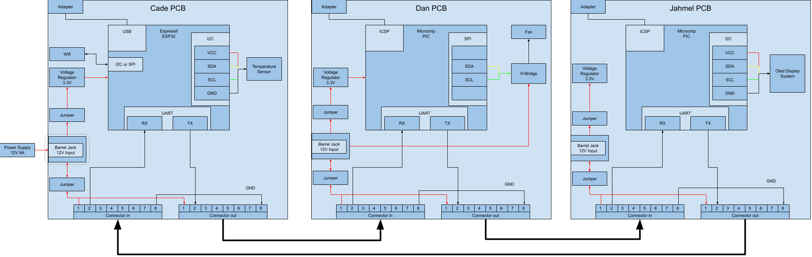
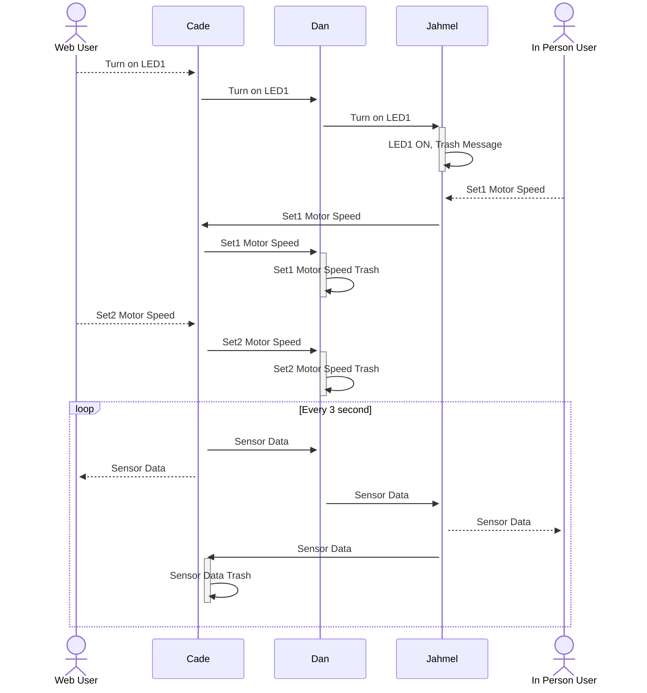

---
tags:
- tag1
---

## **Block Diagram**
The team’s block diagram outlines the flow of communication and functionality across different components in the system. Cade, utilizing an ESP32 microchip, serves as the central hub for bidirectional communication with the other team members, who use PIC microcontrollers. Data flows sequentially from Cade to Dan, who manages both sensor integration and actuator control, and then to Jahmel, responsible for the Human-Machine Interface (HMI), before looping back to Cade. The boards communicate via UART, ensuring reliable data transmission between each module. Additionally, the sensor and actuator exchange data through either SPI or I2C protocols, enabling efficient and precise control of the system’s operation.

## **Sequence Diagram**

The sequence diagram illustrates the communication flow between users and system components, ensuring synchronized operation. When a Web User requests to turn on LED1, the command is passed sequentially from Cade to Dan, and then to Jahmel, who activates the LED and discards the processed message. Similarly, when an In-Person User sets the motor speed, the request travels from Jahmel to Cade, and then to Dan, who executes the command before discarding the message. Additionally, sensor data is transmitted in a continuous 1-second loop, where Dan sends data to Jahmel. Jahmel provides real-time feedback to the In-Person User while also relaying the data to Cade, who then updates the Web User before discarding the received data. This structured communication ensures efficient data flow and command execution throughout the system.

## Message ID

The Message ID table defines the unique identifiers for system members and their associated addresses. Each member is assigned a specific ID and address for communication within the system.

| Member        | System            | ID  | Address |
|---------------|-------------------|-----|---------|
| Cade Clonts   | Wifi              | 1   | 0x01    |
| Jahmel        | Human Interface   | 2   | 0x02    |
| Dan           | Fan Control       | 3   | 0x03    |
| Broadcast     | All               | 88  | 0x58    |

### Status

The Status table defines the status codes used in the system to indicate the state of a message or operation.

| Status | Code  |
|--------|-------|
| Normal | 0x00  |
| Error  | 0x01  |

## Message Types

The Message Types table categorizes the types of messages and their associated status or code ranges.

| Category         | Status/Code | Address |
|------------------|-------------|----|
| Temp Data        | 0 to 255  | 0x10 |
| Fan Control      | 0 to 3    | 0x20 |

---

### Temperature Sensor (Message Type 1)

The Temperature Sensor table defines the structure of messages for temperature data. Each byte in the message is mapped to a specific variable, with details about its type, range, and example values.

| Byte | Variable Name | Variable Type | Min Value | Max Value | Example Value |
|---|------------------|--------------|-----------|-----------|--------------|
| 1 | prefix_1        | uint8_t      | 0x41      | 0x41      | 0x41         |
| 2 | prefix_2        | uint8_t      | 0x5a      | 0x5a      | 0x5a         |
| 3 | source_id       | uint8_t      | 1         | 3         | 0x03         |
| 4 | destination_id  | uint8_t      | 1         | 3 & 88    | 0x58         |
| 5 | message_type    | uint8_t      | 0x10      | 0x10      | 0x10         |
| 6 | temp_id         | uint8_t      | 0         | 255       | 0x01         |
| 7 | status          | uint8_t      | 0         | 1         | 0x01         |
| 8 | temp_data_integer | uint8_t    | 0         | 255       | 25           |
| 9 | temp_data_fraction | uint8_t   | 0         | 99        | 50           |
| 10-62 | Unused       | uint8_t     | 0x00       | 0x00     | 0x00         |
| 63 | suffix_1        | uint8_t      | 0x59      | 0x59      | 0x59         |
| 64 | suffix_2        | uint8_t      | 0x42      | 0x42      | 0x42         |

### Fan Control (Message Type 2)

The Fan Control table defines the structure of messages for controlling fan speed. Each byte in the message is mapped to a specific variable, with details about its type, range, and example values.

| Byte  | Variable Name   | Variable Type | Min Value | Max Value | Example Value |
|-------|-----------------|--------------|-----------|-----------|--------------|
| 1     | prefix_1        | uint8_t      | 0x41      | 0x41      | 0x41         |
| 2     | prefix_2        | uint8_t      | 0x5a      | 0x5a      | 0x5a         |
| 3     | source_id       | uint8_t      | 1         | 3         | 0x01         |
| 4     | destination_id  | uint8_t      | 1         | 3 & 88    | 0x04         |
| 5     | message_type    | uint8_t      | 0x20      | 0x20      | 0x20         |
| 6     | fan_id          | uint8_t      | 0         | 1         | 0x02         |
| 7     | status          | uint8_t      | 0         | 1         | 0x01         |
| 8     | fan_speed_data  | uint8_t      | 0         | 3         | 0x02         |
| 9     | fan_speed_set   | uint8_t      | 0         | 3         | 0x01         |
| 10-62 | Unused          | uint8_t      | 0x00      | 0x00      | 0x00         |
| 63    | suffix_1        | uint8_t      | 0x59      | 0x59      | 0x59         |
| 64    | suffix_2        | uint8_t      | 0x42      | 0x42      | 0x42         |

