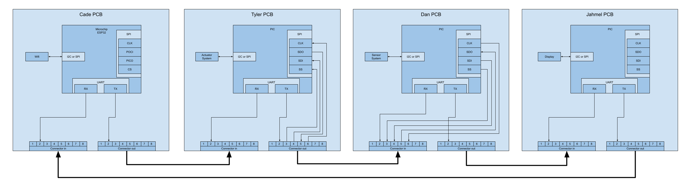
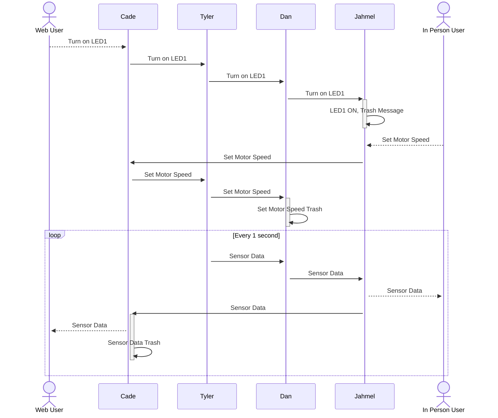

## **Block Diagram**
The team’s block diagram outlines the flow of communication and functionality across different components in the system. Cade, utilizing an ESP32 microchip, serves as the central hub for bidirectional communication with the other team members, who use PIC microcontrollers. Data flows sequentially from Cade to Tyler, who manages sensor integration, then to Dan, who controls the actuator, and finally to Jahmel, responsible for the Human-Machine Interface (HMI), before looping back to Cade. The boards communicate via UART, ensuring reliable data transmission between each module. Additionally, the sensor and actuator exchange data through either SPI or I2C protocols, enabling efficient and precise control of the system’s operation.

## **Sequence Diagram**

The sequence diagram illustrates the communication flow between users and system components, ensuring synchronized operation. When a Web User requests to turn on LED1, the command is passed sequentially from Cade to Tyler, then to Dan, and finally to Jahmel, who activates the LED and discards the processed message. Similarly, when an In-Person User sets the motor speed, the request travels from Jahmel to Cade, through Tyler, and then to Dan, who executes the command before discarding the message. Additionally, sensor data is transmitted in a continuous 1-second loop, where Tyler sends data to Dan, who forwards it to Jahmel. Jahmel provides real-time feedback to the In-Person User while also relaying the data to Cade, who then updates the Web User before discarding the received data. This structured communication ensures efficient data flow and command execution throughout the system.

