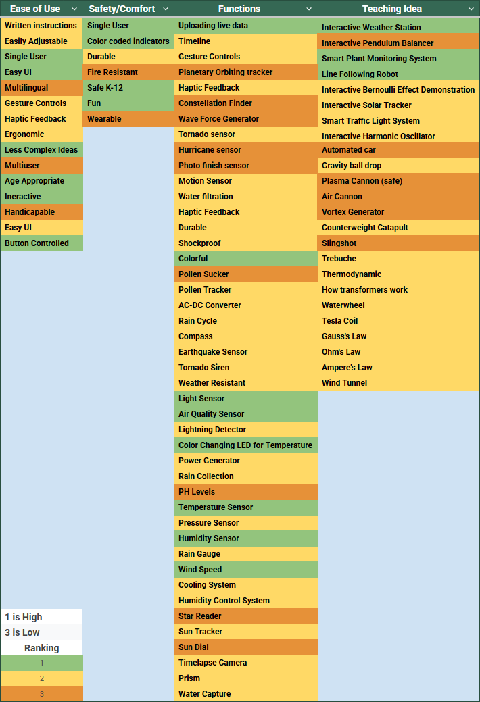

## **Goal of Exhibit** 

The goal of the exhibit is to create interactive, engaging, and educational experiences tailored to Kindergarten through 12th-grade students. Using interactive features, the exhibit aims to foster curiosity and active exploration by encouraging students to engage directly with scientific, cultural, or artistic concepts. By incorporating age-appropriate, hands-on activities, the exhibit seeks to make learning enjoyable and memorable while addressing key educational objectives such as understanding cause-and-effect relationships, correcting misconceptions, and sparking interest in the subject matter. The primary focus is on ensuring that students can interact with the exhibit in meaningful ways, promoting discovery and conceptual understanding through well-designed, intuitive, and durable interactive elements.

## **Who is our Audience?**

The audience for the exhibit is Kindergarten through 12th-grade students, representing a wide range of developmental stages, interests, and learning styles. The exhibit is designed to cater to this diverse group by providing engaging, hands-on activities that are accessible and educational for younger children while still challenging and thought-provoking for older students. It considers the physical, cognitive, and social needs of the audience, ensuring the content is age-appropriate, visually appealing, and interactive. Additionally, the design emphasizes inclusivity, accommodating students with varying abilities and encouraging group interactions to reflect the collaborative nature of learning at this age. 

## **Generated Ideas**

  
## **Sorted and Ranked Ideas**

Rank     |         Quality 
---------|----------------
1        |         High
2        |         Medium 
3        |         Low

## **Concept Sketch**
import pdf file here 

Our display will highlight a STEM-related topic through a mock cooling station. The main idea is to show how different environmental conditions and design choices can affect temperature regulation and heat transfer. We will create an enclosure that represents the environment where cooling data is collected. Inside, sensor will monitor temperature and other relevant metrics, transferring this information to an LED screen for users to view. The LED screen will also be paired with controls that allow the user to adjust cooling. With this concept, our team will be able to create an inclusive, functional exhibit that divides responsibilities effectively among members.

Our project will be divided into four key systems: Sensor, Actuator, Human-Machine Interface (HMI), and Wi-Fi Communication. The Sensor system will gather environmental data and relay it to both the LED screen and control unit. Cade will lead this section. The Actuator system will control the cooling elements, such as turning fans, and will be led by Dan. The HMI system will consist of an LED screen with a few control buttons. The screen will display temperature and cooling system data, while the buttons allow users to select preset cooling modes. Jahmel will lead this section. Finally, the Wi-Fi Communication system will manage bidirectional data transfer via the internet, allowing remote monitoring or control if desired. This section will also be led by Cade.

## **Video Presentation**

<iframe width="560" height="315" src="https://www.youtube.com/embed/fRhLtXQKH90?si=A_yCgXLyiOBgJdsG" title="YouTube video player" frameborder="0" allow="accelerometer; autoplay; clipboard-write; encrypted-media; gyroscope; picture-in-picture; web-share" referrerpolicy="strict-origin-when-cross-origin" allowfullscreen></iframe>

