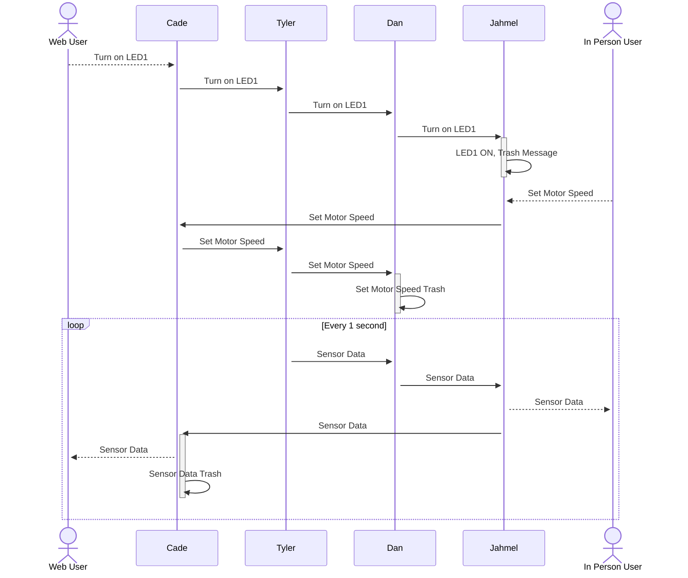

## **Block Diagram**

## **Sequence Diagram**

``` mermaid
sequenceDiagram
    actor Web User
    Web User-->>+Cade: Turn on LED1
    Cade->>+Tyler: Turn on LED1
    Tyler->>+Dan: Turn on LED1
    Dan->>+Jahmel: Turn on LED1
    Jahmel->>-Jahmel: LED1 ON, Trash Message
    actor In Person User
    In Person User-->>+Jahmel: Set Motor Speed
    Jahmel->>+Cade: Set Motor Speed
    Cade->>+Tyler: Set Motor Speed
    Tyler->>+Dan: Set Motor Speed
    Dan->>-Dan: Set Motor Speed Trash
    loop Every 1 second
    Tyler->>+Dan: Sensor Data
    Dan->>+Jahmel: Sensor Data
    Jahmel-->>+In Person User: Sensor Data
    Jahmel->>+Cade: Sensor Data
    Cade-->>+Web User: Sensor Data
    Cade->>-Cade: Sensor Data Trash
    end
```

